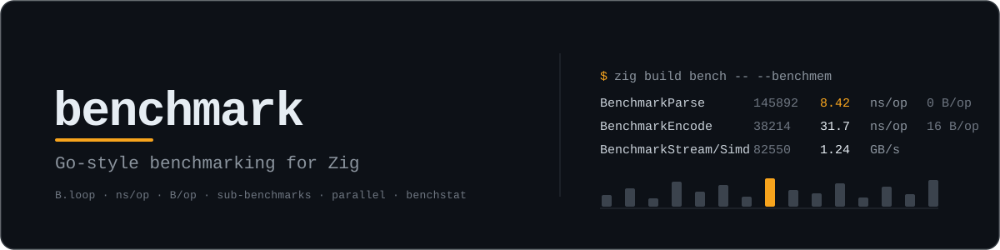

<p align="center">
  
</p>

[](https://ziglang.org/)
[](LICENSE)

A Go-style benchmark module for Zig: predictable harnesses, stable `ns/op` output, allocation metrics, sub-benchmarks, parallel runs, and `benchstat`-friendly results without each project growing its own half-haunted benchmark runner.

```zig
const bench = @import("benchmark");

pub fn benchmarkHash(b: *bench.B) !void {
    const input = b.blackBox("hello" ** 64);
    var out: u64 = 0;

    while (try b.loop()) {
        out = hash(input);
    }

    b.keepAlive(out);
    b.setBytes(input.len);
}
```

```text
zig_os: macos
zig_arch: aarch64
zig_cpu: apple_m1
zig_mode: ReleaseFast
BenchmarkAsciiCount/Scalar    96475    626.6 ns/op    5719.41 MB/s       0 B/op    0 allocs/op
BenchmarkAsciiCount/Table     71222    848.7 ns/op    4223.06 MB/s       0 B/op    0 allocs/op
BenchmarkAllocPerLine        113122    531.8 ns/op       2096 B/op       4 allocs/op
```

If you know Go's `testing.B`, this should feel familiar. If you do not, the important bit is simpler: write a function, call `b.loop()`, get useful numbers.

## Why use it?

Zig gives you the primitives to measure code, but every project still needs the same boring harness pieces: warmup, iteration scaling, timer controls, CLI flags, allocation counting, environment metadata, formatting, filtering, and repeat runs. This module packages those pieces behind a small API so your benchmark files stay focused on the thing being measured.

It gives you:

- automatic discovery of exported `benchmarkFoo` / `BenchmarkFoo` functions
- `b.loop()` timing that excludes setup and cleanup by default
- old-school `b.n` support when you want direct iteration control
- `b.keepAlive` and `b.blackBox` helpers to fight optimizer lies
- `b.setBytes`, `b.reportMetric`, `B/op`, and `allocs/op`
- sub-benchmarks named with `/`, shaped for `benchstat`
- `runParallel` for concurrent workloads
- build-system helpers that generate the benchmark executable for you

## Add it to a project

Add the package as a dependency named `benchmark`:

```sh
zig fetch --save git+https://github.com/mattrobenolt/zig-benchmark
```

In `build.zig`, import the dependency's build helpers and create a benchmark step:

```zig
const std = @import("std");
const benchmark = @import("benchmark");

pub fn build(b: *std.Build) void {
    const target = b.standardTargetOptions(.{});
    const optimize = b.standardOptimizeOption(.{});

    const benchmark_dep = b.dependency("benchmark", .{
        .target = target,
        .optimize = optimize,
    });

    const benchmark_root = b.createModule(.{
        .root_source_file = b.path("src/benchmarks.zig"),
        .target = target,
        .optimize = optimize,
    });

    const run_benchmarks = benchmark.addRunTest(b, .{
        .dependency = benchmark_dep,
        .root_module = benchmark_root,
    });
    if (b.args) |args| run_benchmarks.addArgs(args);

    const bench_step = b.step("bench", "Run benchmarks");
    bench_step.dependOn(&run_benchmarks.step);
}
```

Then run:

```sh
zig build bench
zig build bench -- --count=10 --benchtime=250ms --benchmem
```

`addRunTest` is the normal integration point. It injects `@import("benchmark")` into the benchmark root module, generates the executable entrypoint, uses `std.heap.smp_allocator`, parses CLI flags, and calls `runModuleBenchmarks`.

If you need the executable without a run step, use `addTest`; it returns the `*std.Build.Step.Compile`.

## Write benchmarks

A benchmark module exports functions that accept `*bench.B` and return `anyerror!void`:

```zig
const bench = @import("benchmark");

pub fn benchmarkAdd(b: *bench.B) !void {
    var x: u64 = 0;
    while (try b.loop()) {
        x +%= 1;
    }
    b.keepAlive(x);
}
```

Exported declarations whose names begin with `Benchmark` or `benchmark` are discovered automatically. Lowercase Zig-style names are printed in Go-style form, so `benchmarkAdd` reports as `BenchmarkAdd`.

Use sub-benchmark names with slashes when you want benchstat-friendly comparisons:

```zig
pub fn benchmarkParser(b: *bench.B) !void {
    _ = try b.run("Baseline", benchmarkParserBaseline);
    _ = try b.run("SIMD", benchmarkParserSimd);
}
```

## Loop style

The preferred shape is `b.loop()`, similar to Go 1.26's `B.Loop`:

```zig
pub fn benchmarkHash(b: *bench.B) !void {
    const input = b.blackBox("hello" ** 64);
    var out: u64 = 0;

    while (try b.loop()) {
        out = hash(input);
    }

    b.keepAlive(out);
}
```

The first call to `b.loop()` resets the timer, so setup before the loop is not measured. When `b.loop()` returns `false`, the timer is stopped, so cleanup after the loop is not measured.

Zig cannot do Go's compiler rewrite that automatically keeps every value inside the loop alive. Use `b.keepAlive(value)` for outputs and `b.blackBox(value)` for inputs that should not be constant-propagated away.

## `b.n` style

Old Go-style `B.N` benchmarks are supported as `b.n`:

```zig
pub fn benchmarkHashN(b: *bench.B) !void {
    const input = b.blackBox("hello" ** 64);
    var out: u64 = 0;

    b.resetTimer();
    var i: u64 = 0;
    while (i < b.n) : (i += 1) {
        out = hash(input);
    }

    b.keepAlive(out);
}
```

With `b.n` style the benchmark function may be called multiple times while the runner searches for a stable iteration count. Call `b.resetTimer()` yourself if setup should be excluded.

## Timers

`B` provides the same basic timer controls as Go:

```zig
b.stopTimer();
// expensive setup that should not count
b.startTimer();

// measured work

b.resetTimer(); // zero elapsed time and allocation counters
```

`b.elapsed()` returns measured nanoseconds according to the benchmark timer, including the current running interval if the timer is on.

## Throughput and custom metrics

Use `setBytes` to report throughput:

```zig
b.setBytes(input.len);
```

That adds an `MB/s` column in addition to `ns/op`.

Use `reportMetric` for extra values. If the metric is per operation, divide by `b.n` yourself and use a unit ending in `/op`:

```zig
try b.reportMetric(@as(f64, @floatFromInt(items)) / @as(f64, @floatFromInt(b.n)), "items/op");
```

`reportMetric` rejects empty units and units containing whitespace. Like Go, custom metrics named `ns/op`, `MB/s`, `B/op`, or `allocs/op` override the built-in metric with that unit.

## Allocation metrics

Use `b.allocator` for allocations you want counted:

```zig
pub fn benchmarkAlloc(b: *bench.B) !void {
    while (try b.loop()) {
        const memory = try b.allocator.alloc(u8, 256);
        defer b.allocator.free(memory);
        b.keepAlive(memory.ptr);
    }
}
```

Only allocations made through `b.allocator` are counted. Zig does not have Go's process-wide runtime allocation counters, so `B/op` and `allocs/op` are intentionally scoped to this allocator.

Runner/internal allocations use a separate allocator and are not included in benchmark allocation results. The generated main uses `std.heap.smp_allocator` as the backing allocator.

Allocation metrics are printed when either `--benchmem` is passed or a benchmark calls `b.reportAllocs()`.

## Parallel benchmarks

`runParallel` splits `b.n` iterations across worker threads. The worker receives a `*bench.PB`; loop until `pb.next()` returns false:

```zig
fn parallelBody(pb: *bench.PB) !void {
    while (pb.next()) {
        doWork();
    }
}

pub fn benchmarkParallel(b: *bench.B) !void {
    b.setParallelism(2); // workers = parallelism * cpu_count
    try b.runParallel(parallelBody);
}
```

Parallel benchmarks report wall-clock `ns/op` for the benchmark as a whole, not summed CPU time across workers.

## CLI flags

The generated runner supports:

```text
--count=N              run each benchmark N times
--benchtime=250ms      run each benchmark for approximately this long
--benchtime=1000x      run exactly 1000 iterations
--filter=pattern       run benchmarks whose full name matches pattern
--benchmem             print B/op and allocs/op
--parallelism=N        default B.runParallel multiplier
--no-env               suppress environment header lines
```

Duration units are `ns`, `us`, `µs`, `ms`, `s`, `m`, and `h`.

Filters are glob-like, not regular expressions. Plain text remains substring matching. A leading `^` anchors the start, a trailing `$` anchors the end, and `*` matches any bytes:

```text
--filter=Alloc       contains Alloc
--filter='^Bench'    starts with Bench
--filter='Table$'    ends with Table
--filter='^Foo$'     exactly Foo
--filter='Foo*Bar'   Foo followed by Bar
```

By default, the runner emits Zig environment metadata before benchmark rows:

```text
zig_os: macos
zig_arch: aarch64
zig_abi: none
zig_cpu: apple_m1
zig_mode: ReleaseFast
```

Writers are flushed after every benchmark row.

## Custom runners

Most projects should use `addRunTest`. If you need your own `main`, build a slice of `bench.Spec` and call the runner directly:

```zig
const std = @import("std");
const bench = @import("benchmark");

fn benchmarkThing(b: *bench.B) !void {
    while (try b.loop()) {
        doThing();
    }
}

pub fn main() !u8 {
    const allocator = std.heap.smp_allocator;
    var args = std.process.args();
    const options: bench.Options = try .parse(&args, .{});

    const specs = [_]bench.Spec{
        .{ .name = "BenchmarkThing", .func = benchmarkThing },
    };

    return @intFromBool(!try bench.runBenchmarks(allocator, &specs, options));
}
```

For one-off programmatic measurement, use `benchmark`:

```zig
var result = try bench.benchmark(allocator, benchmarkThing, .{ .benchtime = .{ .count = 1000 } });
defer result.deinit(allocator);

const ns_per_op = result.nsPerOp();
```

`Result` owns duplicated metric keys, so call `deinit` when you keep a returned result.

## Examples

This repository includes:

```sh
zig build test
zig build run-example -- --count=2 --filter=Alloc
zig build run-compare -Doptimize=ReleaseFast -- --count=10 --benchtime=100ms
zig build run-benchmark -Doptimize=ReleaseFast -- --count=10 --benchtime=100ms
zig build run-consumer
```

`examples/consumer` is a standalone project that consumes this package through `build.zig.zon` and uses `addRunTest`.

`examples/compare.zig` compares two ASCII lowercase counting implementations as `BenchmarkAsciiCount/Scalar` and `BenchmarkAsciiCount/Table`, plus an allocation-heavy benchmark to exercise `B/op` and `allocs/op`.

`benchmarks/filter.zig` benchmarks this package's own glob filter matcher.

The comparison example is shaped for `benchstat`:

```sh
zig build run-compare -Doptimize=ReleaseFast -- --count=10 --benchtime=100ms > compare.txt
benchstat -row .name -col .fullname compare.txt
```

## License

MIT.
